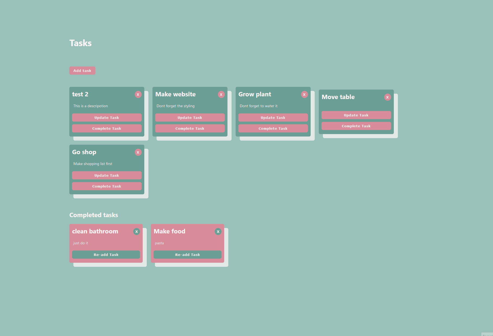

### `One more to-do app`

Just trying out express and making some basic api.

Made with create-react-app, express and Mysql.



## `Before using`

Import "taskcontroller_schema.sql" into Mysql, take note of your credentials.

In "**backend/index.js**"
Replace the current credentials with your own:

```
host: "localhost",
user: "apiUser",
password: "",
database: "taskcontroller",
```

### `npm start`

Runs the app in the development mode.\
Open [http://localhost:3000](http://localhost:3000) to view it in your browser.

==You need to start up both backend and client!==
